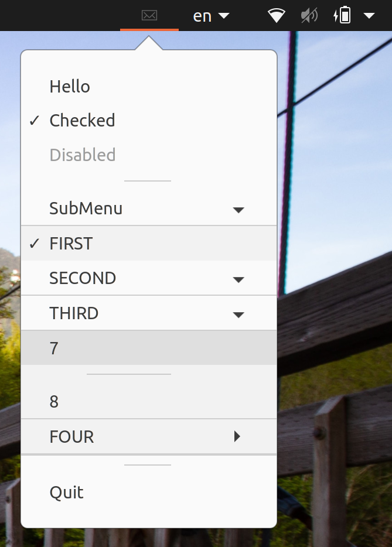
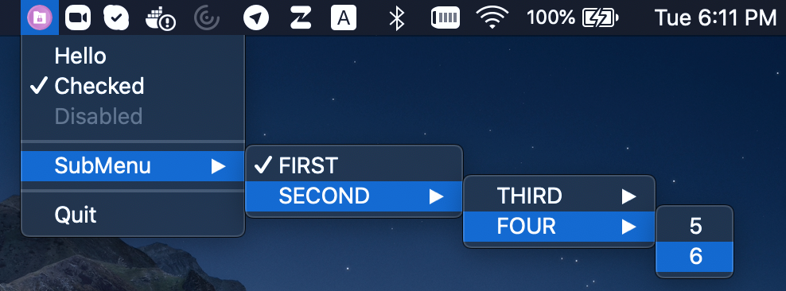
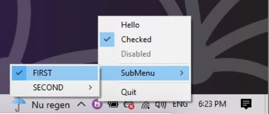

<div align="center">
  
  <h1 align="center">tray</h1>
  <h4 align="center">Cross-platform implementation of a system tray icon with a popup menu and notifications.</h4>
</div>

<div align="center">
  <a href="https://github.com/LizardByte/tray"></a>
  <a href="https://github.com/LizardByte/tray/actions/workflows/ci.yml?query=branch%3Amaster"></a>
  <a href="https://docs.lizardbyte.dev/projects/tray"></a>
  <a href="https://codecov.io/gh/LizardByte/tray"></a>
  <a href="https://sonarcloud.io/project/overview?id=LizardByte_tray"></a>
</div>

# Overview

## ℹ️ About

Cross-platform, super tiny C99 implementation of a system tray icon with a popup menu and notifications.

The code is C++ friendly and will compile fine in C++98 and up. This is a fork of
[dmikushin/tray](https://github.com/dmikushin/tray) and is intended to add additional features required for our own
[Sunshine](https://github.com/LizardByte/Sunshine) project.

This fork adds the following features:

- system tray notifications
- unit tests
- code coverage
- refactored code, e.g., moved source code into the `src` directory
- doxygen documentation and readthedocs configuration

## 🖼️ Screenshots

<div class="tabbed">
  <ul>
    <li><b class="tab-title">Linux</b><br>
      
    </li>
    <li><b class="tab-title">macOS</b><br>
      
    </li>
    <li><b class="tab-title">Windows</b><br>
      
    </li>
  </ul>
</div>

## 🖥️ Supported platforms

* Linux/Qt (Qt5 or Qt6 Widgets)
* Windows XP or newer (shellapi.h)
* MacOS (Cocoa/AppKit)

## 📋 Prerequisites

* CMake
* [Ninja](https://ninja-build.org/), to have the same build commands on all platforms.

### Linux Dependencies

Install either Qt6 _or_ Qt5 as well as libnotify development packages. The Linux backend requires libnotify and Qt Widgets+Svg modules.

<div class="tabbed">

- <b class="tab-title">Arch</b>
    ```bash
    # Qt6
    sudo pacman -S qt6-base qt6-svg libnotify

    # Qt5
    sudo pacman -S qt5-base qt5-svg libnotify
    ```

- <b class="tab-title">Debian/Ubuntu</b>
    ```bash
    # Qt6
    sudo apt install qt6-base-dev qt6-svg-dev libnotify-dev

    # Qt5
    sudo apt install qtbase5-dev libqt5svg5-dev libnotify-dev
    ```

- <b class="tab-title">Fedora</b>
    ```bash
    # Qt6
    sudo dnf install qt6-qtbase-devel qt6-qtsvg-devel libnotify-devel

    # Qt5
    sudo dnf install qt5-qtbase-devel qt5-qtsvg-devel libnotify-devel
    ```

</div>

## 🛠️ Building

```bash
mkdir -p build
cmake -G Ninja -B build -S .
ninja -C build
```

## ⚙️ Python Tooling

Install [uv](https://docs.astral.sh/uv/) and initialize the shared tooling submodule:

```bash
git submodule update --init --recursive third-party/lizardbyte-common
uv run --project third-party/lizardbyte-common --locked --only-group lint-c \
  python third-party/lizardbyte-common/scripts/update_clang_format.py
```

## ▶️ Demo

Execute the `tray_example` application:

```bash
./build/tray_example
```

## ✅ Tests

Execute the `tests` application:

```bash
./build/tests/test_tray
```

## 📚 API

Tray structure defines an icon and a menu.
Menu is a NULL-terminated array of items.
Menu item defines menu text, menu checked and disabled (grayed) flags and a
callback with some optional context pointer.

```c
struct tray {
  char *icon;
  struct tray_menu *menu;
};

struct tray_menu {
  char *text;
  int disabled;
  int checked;

  void (*cb)(struct tray_menu *);
  void *context;

  struct tray_menu *submenu;
};
```

* `int tray_init(struct tray *)` - creates tray icon. Returns -1 if tray icon/menu can't be created.
* `void tray_update(struct tray *)` - updates tray icon and menu.
* `int tray_loop(int blocking)` - runs one iteration of the UI loop. Returns -1 if `tray_exit()` has been called.
* `void tray_exit()` - terminates UI loop.

All functions are meant to be called from the UI thread only.

Menu arrays must be terminated with a NULL item, e.g. the last item in the
array must have text field set to NULL.

## 📄 License

This software is distributed under [MIT license](http://www.opensource.org/licenses/mit-license.php),
so feel free to integrate it in your commercial products.

<details style="display: none;">
  <summary></summary>
  [TOC]
</details>
